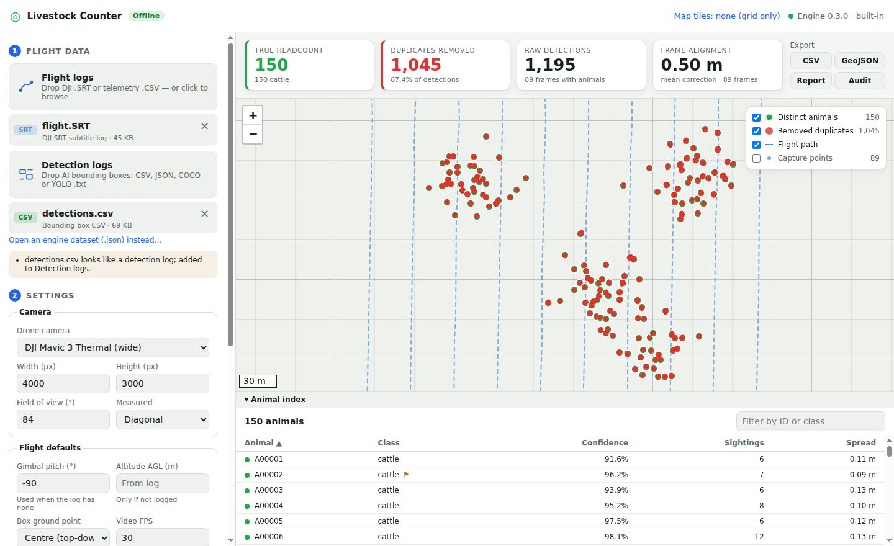
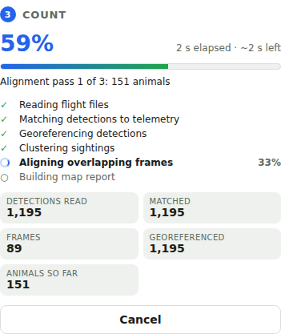

# Livestock Monitoring – Offline Desktop Application

An offline desktop utility that fixes **livestock over-counting** caused by
overlapping drone flight paths. When survey images overlap (typically 60–80 %),
the same animal is detected in 5–10 frames. This project maps every detection
to real-world coordinates and collapses repeat sightings into one record per
animal.

The repository contains:

* **Phase 1 – core spatial processing engine** (`src/livestock_engine`, Python):
  ray casting, UTM mapping, DBSCAN de-duplication, and a CLI.
* **Phase 2 – offline desktop app** (`desktop/`, Electron + React + Leaflet):
  drag-and-drop of DJI `.SRT` / telemetry CSVs and AI bounding-box logs, and
  an offline map with green distinct animals and red removed duplicates.
  See [`desktop/README.md`](desktop/README.md).
* **Phase 3 – standalone installers**: the engine is frozen with PyInstaller
  and shipped inside the app, with a live processing dashboard. Installers
  are `.exe` / `.dmg` / AppImage / `.deb` and need no Python, Node.js or network.
* **Phase 4 – validation, performance and handover**:
  - dense-group mode for sheep yards and feedlots;
  - 50k–220k detection surveys processed in seconds;
  - a validation tool for real flights;
  - integration guides with JSON Schemas;
  - reproducible build and source packages.

## Documentation

| Guide | For |
| --- | --- |
| [docs/USER_GUIDE.md](docs/USER_GUIDE.md) | pilots using the app in the field |
| [docs/INTEGRATION_GUIDE.md](docs/INTEGRATION_GUIDE.md) + [schemas/](schemas) | developers producing input files or consuming results |
| [docs/DEVELOPER_GUIDE.md](docs/DEVELOPER_GUIDE.md) | maintainers: architecture, setup, tests, extension points |
| [docs/BUILD_AND_RELEASE.md](docs/BUILD_AND_RELEASE.md) | building signed installers per OS; release procedure |
| [docs/PERFORMANCE.md](docs/PERFORMANCE.md) | accuracy and speed validation results |
| [docs/HANDOVER.md](docs/HANDOVER.md) | deliverables, IP and licensing, open items |
| [desktop/README.md](desktop/README.md) | the Electron app's internals and security model |
| [CHANGELOG.md](CHANGELOG.md) | release history |



## Phase 4 at a glance

| Sprint | Deliverable | Where |
| --- | --- | --- |
| 4.1 Stress testing | Full raw-log pipeline at 55k / 110k / 221k detections: 4.7 / 10.3 / 21.0 s, linear, 100% accurate (`livestock-engine stress`). Engine 2.8× faster at 55k; desktop map 16× faster at 221k (canvas point layers, virtualised table) | `dedup.py`, `desktop/src/renderer/src/lib/pointLayer.ts` |
| 4.1 Tight animal groups | Dense-group mode: in-image spacing detection, clustering-free frame pre-alignment, adaptive ε, same-image double-box suppression. Sheep yards 0.6–0.9 m apart: 72–96% → **99.4–99.9%**, with no under-counting | `density.py`, `sync.py` |
| 4.1 Real-flight validation | `livestock-engine validate` scores any report against surveyed positions or gate counts | `validation.py` |
| 4.2 Integration guides | Input schemas, frame-matching rules, outputs, CLI, Python API. JSON Schemas are tested against real output; the docs are tested against the code | `docs/INTEGRATION_GUIDE.md`, `schemas/` |
| 4.2 Handover package | Developer / build / pilot guides, pinned build environments, license inventory, reproducible source archive | `docs/`, `requirements*.txt`, `Makefile`, `packaging/` |

## Phase 3 at a glance

| Sprint | Deliverable | Where |
| --- | --- | --- |
| 3.1 IPC pipeline binding | Files admitted in the UI become opaque ids; **Run** sends validated settings over IPC, and the main process launches the engine on the registered paths | `desktop/src/main/ipc.ts`, `engine.ts` |
| 3.1 Real-time progress | The engine reports 6 weighted stages (read → match → georeference → cluster → align → report) with per-frame and per-pass updates and live counters, throttled to 10 Hz and never going backwards; the dashboard shows a stage checklist, overall %, elapsed time and time remaining | `livestock_engine/progress.py`, `ProgressPanel.tsx` |
| 3.2 PyInstaller engine | One-folder frozen `livestock-engine` (about 180 MB, 70 MB compressed; starts in about 1.5 s). The build script checks that it runs **with no Python on PATH** and counts the sample flight correctly | `packaging/` |
| 3.2 electron-builder | NSIS `.exe` (Windows x64), `.dmg` (macOS arm64 and x64), AppImage/`.deb` (Linux). Maximum compression, Electron fuses on, UI served from `app://`, no update feed | `desktop/electron-builder.config.cjs` |
| Milestone 3 | A CI release matrix builds each installer on its own OS, then launches the packaged app offline without Python and checks the headcount | `.github/workflows/release.yml`, `desktop/e2e/release-check.mjs` |



Build an installer for the machine you're on:

```bash
pip install -e . pyinstaller
python packaging/build_engine.py        # frozen engine -> desktop/resources/engine (self-tested)
cd desktop && npm ci
npm run package:win | package:mac | package:linux
npm run test:release                    # launch the packaged app offline, no Python, and count the sample
```

Push a `v*` tag, or run the **Release installers** workflow, to build all
platforms and attach them to a draft GitHub release.

## Phase 2 at a glance

| Sprint | Deliverable | Where |
| --- | --- | --- |
| 2.1 Native app & local files | Electron + React + TypeScript shell, sandboxed renderer, typed and validated IPC; Node.js runs the Python engine as a child process | `desktop/src/main`, `desktop/src/preload` |
| 2.1 Drop zones | Flight-log zone (`.SRT`, telemetry CSV) and detection-log zone (CSV / JSON / COCO / YOLO `.txt`), with automatic file-type detection | `desktop/src/renderer`, `livestock_engine/ingest` |
| 2.2 Offline spatial viewer | Leaflet map fed from a local XYZ tile cache through a custom `tiles://` protocol, with a neutral grid when no cache exists | `desktop/src/main/tiles.ts`, `MapView.tsx` |
| 2.2 Data layers | Green = distinct animals (cluster centroids), red = removed duplicate entries, plus the flight path, capture points and sighting links | `MapView.tsx`, `livestock_engine/report.py` |
| Milestone 2 | Load a flight, count it and view the mapped coordinates locally. Verified by an end-to-end Electron test | `desktop/e2e/smoke.mjs` |

Quick start for the desktop app (needs Python with this package installed, plus Node.js ≥ 20):

```bash
pip install -e .
cd desktop && npm install && npm run dev
# then drop examples/sample-flight/flight.SRT and detections.csv into the app
```

## Phase 1 at a glance

| Sprint | Deliverable | Module |
| --- | --- | --- |
| 1.1 Ray-casting & coordinate mapping | Pixel (x, y) + altitude, heading, gimbal pitch/roll, FOV → UTM easting/northing (`pyproj`, `numpy`) | `camera.py`, `projection.py`, `geo.py` |
| 1.2 DBSCAN cluster optimisation | DBSCAN (`scikit-learn`, ε = 2.0 m) + structural resolution to one centroid per animal, keeping the highest-confidence class | `dedup.py` |
| Accuracy hardening | Frame-to-consensus registration that cancels per-frame telemetry error | `registration.py` |
| Milestone 1 | CLI with a simulator and a benchmark that verifies ≥ 99 % accuracy | `simulate.py`, `metrics.py`, `cli.py` |

`livestock-engine self-check` imports every native dependency and runs PROJ
and DBSCAN once. The desktop app uses it to validate an engine before running it.

## Install

Requires Python ≥ 3.11. For exact, reproducible versions use `pip install -r requirements-dev.txt && pip install --no-deps -e .`

```bash
pip install -e ".[dev]"
```

## Quick start

```bash
# 1. Generate a simulated overlapping survey (150 cattle, 70 % / 60 % overlap)
livestock-engine simulate -o output/flight.json --seed 7

# 2. De-duplicate it
livestock-engine dedup output/flight.json -o output/animals.csv \
    --geojson output/animals.geojson \
    --assignments output/assignments.csv \
    --frame-corrections output/frame_corrections.csv \
    --evaluate

# 3. Verify the Milestone 1 accuracy gate (exit code 1 if below threshold)
livestock-engine benchmark --runs 10 --profile standard --profile oblique \
    --profile dense --profile harsh
```

`python -m livestock_engine ...` works as well.

### Raw flight logs (Phase 2 ingestion)

The engine also reads the files a pilot brings home. It joins each bounding
box to the telemetry by image name, video frame number or time offset:

```bash
# Write a simulated survey as raw logs (DJI .SRT, per-photo telemetry CSV, box CSV)
livestock-engine simulate -o output/sim.json --export-raw output/raw [--no-gimbal-yaw]

# Join logs into an engine dataset…
livestock-engine ingest --telemetry output/raw/flight.SRT --detections output/raw/detections.csv \
    --image-width 4000 --image-height 3000 --fov 84 --fov-type diagonal -o output/dataset.json

# …or ingest, de-duplicate and write the desktop map report in one step
livestock-engine process --telemetry output/raw/flight.SRT --detections output/raw/detections.csv \
    --report output/report.json -o output/animals.csv [--progress]
```

| Input | Supported |
| --- | --- |
| Telemetry | DJI `.SRT` subtitle logs (Mavic 3 / Air / Mini `[latitude: …]` style, Phantom 4 `GPS(…) BAROMETER:`, Mavic Pro `GPS (…) H …m`); telemetry CSVs with flexible column names and units (e.g. AirData `height_above_takeoff(feet)`, `time(millisecond)`) |
| Detections | CSV or JSON with `xmin,ymin,xmax,ymax`, `x,y,width,height`, `cx,cy,w,h` or `x,y`; COCO results; YOLO `.txt` (one per image, normalised); pixel or normalised coordinates |
| Frame link | image name, video frame number (`FrameCnt`, or time = frame / fps), or time offset in seconds (interpolated) |

If the log has no gimbal yaw, the heading is derived from the GPS track. At
lawnmower turns, each photo keeps the heading of the strip it belongs to. On
simulated surveys this still recovers 150/150 animals. Detections that can't
be linked to telemetry, or fall outside the image, are counted and reported as
warnings rather than silently dropped.

## How it works

```
pixel (u, v) ─► camera ray ─► rotate by heading/pitch/roll ─► intersect ground plane
   ─► local UTM (E, N) ─► DBSCAN ε=2 m ─► frame-exclusivity split
   ─► frame registration (repeat) ─► one centroid record per animal
```

### 1. Ray casting (Sprint 1.1)

* **Intrinsics** – pinhole model with square pixels. The focal length in pixels
  is derived from the horizontal, vertical *or* diagonal FOV (drone makers
  usually publish the diagonal one; set `fov_type`).
* **Extrinsics** – camera → ENU rotation from heading (clockwise from north),
  gimbal pitch (0 = horizon, −90 = nadir) and roll. At nadir the top of the
  image points along the heading, matching DJI imagery.
* **Ground intersection** – each ray is intersected with a flat ground plane at
  `altitude_agl_m` below the camera. Rays at/above the horizon or hitting the
  ground beyond `--max-range` (default 1000 m) are rejected and reported.
* **Projection** – one UTM zone (EPSG 326xx/327xx, including the Norway and
  Svalbard exceptions) is chosen for the whole survey so all frames share a
  metric frame. Headings are converted from true north to UTM grid north using
  the local meridian convergence (up to a few degrees away from the central
  meridian — a ~1 m error at image edges if ignored).

### 2. DBSCAN and structural resolution (Sprint 1.2)

* `DBSCAN(eps=2.0, min_samples=1)` groups observations whose ground positions
  lie within an animal's body envelope. `min_samples=1` means an animal seen in
  a single frame is still counted.
* **Frame exclusivity** – two detections in the *same* image are always two
  animals. DBSCAN is single-linkage and chains tightly packed herds into one
  cluster, so any cluster holding several detections from one frame is split by
  constrained agglomerative clustering (closest centroids merge first, same-frame
  pairs cannot link, merges limited to ε).
* **Resolution** – each cluster collapses to an `AnimalRecord`: mean centroid
  (UTM and WGS84), label and confidence of the **highest-confidence**
  observation, `label_votes`, a `class_conflict` flag when observations disagree,
  `spread_m` (max member distance from the centroid), observation count and the
  contributing frame/detection IDs.

### 3. Frame registration

GPS offset, heading, altitude and gimbal errors move *all* of a frame's
projections together, while the layout of animals inside a frame is precise.
After a first clustering pass every frame is aligned (robust, trimmed 2D
similarity transform; translation-only when matches are few or compact) onto
the leave-one-out consensus of the other frames, then clustering is repeated
(3 passes by default). Implausible corrections (> 5 m, > 5°, > 10 % scale) are
rejected. Disable with `--no-registration`; per-frame corrections are written by
`--frame-corrections`.

## Milestone 1 verification

`livestock-engine benchmark` simulates complete lawnmower surveys with known
ground truth and scores the result. Each survey is ~150 frames and ~1,200 raw
detections of 150 animals (~2,000 of 250 for `dense`), i.e. every animal is seen ~8 times.

Metrics (computed against the animals detected at least once — an animal the
detector never saw cannot be recovered by de-duplication):

* **count accuracy** = 1 − |predicted − observed| / observed
* **precision / recall / F1** – one-to-one Hungarian match within 2 m
* **merged / split** – clusters mixing two animals / animals spread over several clusters

Profiles:

| Profile | Scenario |
| --- | --- |
| `ideal` | No noise — checks the geometry is exact |
| `standard` | Nadir, GPS σ 0.25 m, heading σ 0.5°, altitude σ 0.3 m, pitch σ 0.3°, 3 px, 97 % detector recall, 2 % label flips |
| `oblique` | Gimbal −75°, flight lines at 35° |
| `dense` | 250 animals in 3 tight herds, 2.5 m minimum spacing |
| `harsh` | ~1.6–2× the telemetry noise, 6 px, 92 % recall, 5 % label flips |

Results, 10 flights per profile (seeds 0–9, `livestock-engine benchmark --runs 10 ...`):

| Profile | Raw detections → animals | Full engine | No registration | Plain DBSCAN only |
| --- | --- | --- | --- | --- |
| standard | 11,842 → 1,500 | **100.00 %** | 99.93 % | 98.07 % |
| oblique | 13,622 → 1,500 | **100.00 %** | 99.40 % | 94.40 % |
| dense | 19,649 → 2,500 | **100.00 %** | 97.96 % | 79.44 % |
| harsh | 11,283 → 1,502 | **99.87 %** | 93.00 % | 93.40 % |

(Mean count accuracy. "Plain DBSCAN only" = `--no-registration --no-frame-exclusivity`.)

The full engine passes the 99 % gate on every profile; the default ε = 2.0 m is
used throughout.

## Input formats

### JSON

```json
{
  "camera": {"image_width": 4000, "image_height": 3000, "fov_deg": 84, "fov_type": "diagonal"},
  "frames": [
    {
      "frame_id": "DJI_0001",
      "latitude": -33.8688, "longitude": 151.2093,
      "altitude_agl_m": 60.0,
      "heading_deg": 12.5,
      "gimbal_pitch_deg": -90.0,
      "gimbal_roll_deg": 0.0,
      "detections": [
        {"x": 1834.5, "y": 902.0, "label": "cattle", "confidence": 0.94, "detection_id": "optional"}
      ]
    }
  ]
}
```

* `camera` is a shared default; a frame may override any field inline or in its own `camera` block.
* `gimbal_pitch_deg` defaults to −90 (nadir), `gimbal_roll_deg` to 0, `fov_type` to `horizontal`.
* `x`, `y` are pixel coordinates (origin top-left), normally the bounding-box
  centre (or bottom-centre for oblique imagery).
* Simulated datasets also carry `ground_truth` and per-detection `truth_id`,
  which are used only by `--evaluate` / `benchmark`.

### CSV

One row per detection, frame metadata repeated on each row. Required columns:
`frame_id, latitude, longitude, altitude_agl_m, heading_deg, image_width,
image_height, fov_deg, x, y`. Optional: `gimbal_pitch_deg, gimbal_roll_deg,
fov_type, cx, cy, label, confidence, detection_id, timestamp`.

## Outputs

| Option | File | Contents |
| --- | --- | --- |
| `-o` | CSV | One row per unique animal: ID, label, confidence, lat/lon, UTM E/N, observations, spread, class conflict, label votes, frame and detection IDs, EPSG |
| `--geojson` | GeoJSON | Unique animals as points (WGS84) |
| `--assignments` | CSV | Audit trail: each detection's raw and registered position and the animal it became (or why it was rejected) |
| `--frame-corrections` | CSV | Registration model, match count, shift, rotation and scale per frame |
| `--summary-json` / `--json` | JSON | Run summary (counts, label totals, registration stats, evaluation) |

## Assumptions and limits

* **Flat ground** at the altitude-above-ground reference. On hilly sites supply
  AGL per frame (e.g. from a DEM); DEM ray marching is a later-phase item.
* **Heading must be true (not magnetic)**, as recorded by DJI and most autopilots.
* Animals are assumed near-stationary during a survey; animals that walk more
  than ~ε between passes can be double counted.
* Lens distortion is not modelled — undistort pixel coordinates first if the
  camera is not already rectified.

## Development

```bash
pip install -e ".[dev]"
pytest
```

Project layout:

```
docs/                     user, integration, developer, build & release, performance, handover guides
schemas/                  JSON Schemas of every input/output format (tested against real output)
examples/sample-flight/   simulated raw logs (SRT, telemetry CSV, box CSV, truth)
packaging/                PyInstaller spec + build_engine.py (freeze and self-test the engine)
.github/workflows/        CI (tests, packaged E2E) and release (per-OS installers)
desktop/                  Electron + React desktop app (Phase 2) – see desktop/README.md
src/livestock_engine/
  ingest/          SRT / telemetry CSV / bounding-box parsers, telemetry join
  report.py        map-ready JSON report for the desktop app
  progress.py      weighted, throttled stage progress (JSON events)
  density.py       dense-group detection and adaptive cluster radius
  sync.py          clustering-free frame pre-alignment (pairwise voting + pose graph)
  validation.py    scoring reports against real ground truth
  camera.py        camera intrinsics (FOV → focal length) and frame pose
  geo.py           UTM zone selection, WGS84 ↔ UTM, grid convergence
  projection.py    rotation matrices, ray casting, inverse projection
  dedup.py         DBSCAN + frame-exclusivity split + centroid resolution
  registration.py  frame-to-consensus similarity alignment
  pipeline.py      end-to-end orchestration
  io.py            JSON/CSV input, CSV/GeoJSON output
  simulate.py      synthetic overlapping surveys with ground truth
  metrics.py       accuracy evaluation
  cli.py           `livestock-engine` command
tests/             geometry, clustering, ingestion and end-to-end tests
```
